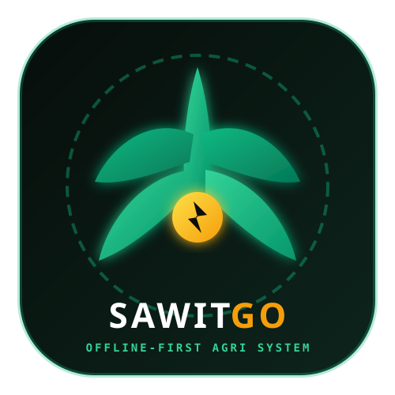
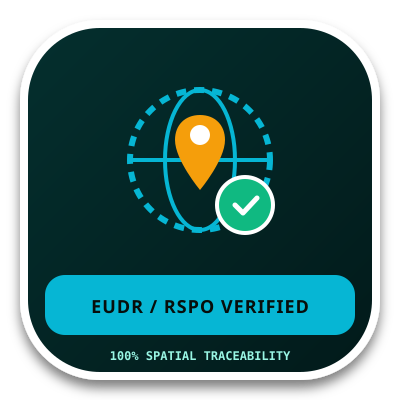
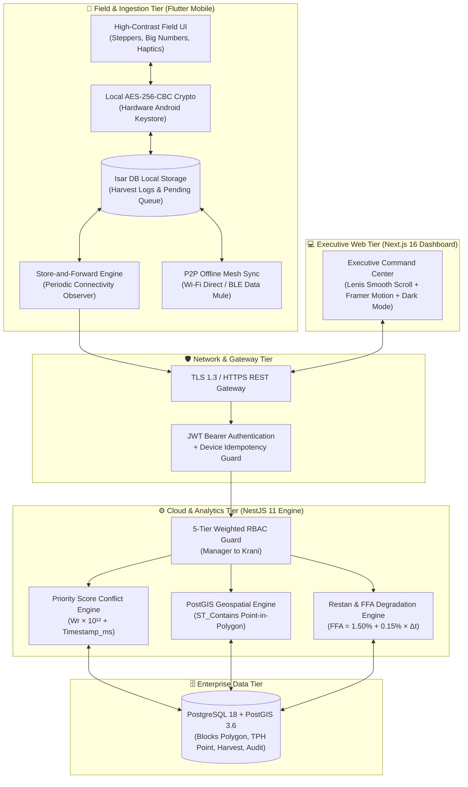

<div align="center">

  

  # 🌴 SawitGO (AgriSync)

  ### *Offline-First Palm Plantation Management & High-Precision Geospatial Traceability System*

  <p align="center">
    <strong>Sistem Cerdas Manajemen Panen Kelapa Sawit Berbasis Arsitektur Terdistribusi <em>Store-and-Forward</em>, Konsensus Hirarkis (Weighted RBAC), dan Ketertelusuran Spasial Standar Global (EUDR / RSPO / ISPO).</strong>
  </p>

  <p align="center">
    <a href="PROPOSAL%20PENELITIAN%20%20RISET%20BPDP%202026-2027%20(1).pdf"></a>
    <a href="docs/PRD.md"></a>
    <a href="docs/system_architecture.md"></a>
    <a href="docs/database_schema.md"></a>
    
    
    
  </p>

  <p align="center">
    
    &nbsp;&nbsp;&nbsp;&nbsp;&nbsp;&nbsp;&nbsp;&nbsp;
    
  </p>

</div>

---

## 📖 Ringkasan Eksekutif Riset

Di sebagian besar perkebunan kelapa sawit Indonesia, **kendala ketiadaan sinyal seluler (*blankspot*)** di areal blok perkebunan menyebabkan keterlambatan rekapitulasi data panen. Hal ini berdampak langsung pada penumpukan buah di TPH (**Restan $> 24$ jam**), yang memicu lonjakan kadar **Asam Lemak Bebas (FFA $> 5\%$)** dan mendegradasi harga jual Tandan Buah Segar (TBS) serta rendemen CPO pabrik kelapa sawit. Di sisi lain, regulasi internasional seperti **EU Deforestation Regulation (EUDR No 2023/1115)** mewajibkan bukti poligon geospasial persil lahan berakurasi tinggi ($< 5.0$ meter).

**SawitGO (AgriSync)** hadir sebagai solusi *cyber-physical* komprehensif yang menggabungkan:
1. **Mobile Ingestion App (*Offline-First*)**: Penyimpanan lokal terenkripsi Isar DB + AES-256 Android Keystore dan sinkronisasi nirkabel P2P Data Mule via armada truk.
2. **Backend Conflict Engine (*NestJS + PostGIS*)**: Algoritma konsensus deterministik berbasis bobot hirarki 5 jenjang jabatan perkebunan (*Weighted RBAC*).
3. **Executive Web Command Center (*Next.js 16 + Lenis + Framer Motion*)**: Dashboard analitik real-time dengan dukungan *Dark Mode (OLED Slate)*, visualisasi GIS poligon PostGIS, dan ekspor instan sertifikat EUDR GeoJSON.

---

## 🏛️ Arsitektur Sistem 4-Tier



---

## ⚡ 6 Fitur Inti Keunggulan Riset (TKT-5)

### 1. 📴 Offline-First Store-and-Forward Ingestion
- **Operasional 100% Offline**: Pencatatan janjang, brondolan, dan grading mutu buah (mentah, masak, lewat masak, tangkai panjang) tersimpan instan ke **Isar DB** lokal tanpa ketergantungan koneksi.
- **Hardware-Level Encryption**: Payload transaksi dienkripsi secara lokal menggunakan **AES-256-CBC** dengan kunci yang tersimpan aman di *Android Hardware Keystore*.
- **Background Worker Cerdas**: Listener konektivitas memeriksa status jaringan (`connectivity_plus`). Begitu perangkat mendeteksi sinyal internet (Wi-Fi/4G), sistem langsung mengirimkan batch payload secara otomatis ke backend.

### 2. ⚖️ Domain-Specific Conflict Resolution (Weighted RBAC)
- Menyelesaikan masalah tabrakan data (*data collision*) saat multi-aktor mengedit TPH yang sama dalam kondisi offline:
  $$\mathbf{Priority\ Score} = (\text{Role Weight} \times 1.000.000.000.000) + \text{Timestamp (ms)}$$
- **Hierarki 5 Jenjang Perkebunan**:
  - `Manager (Weight 5)`: Otoritas tertinggi audit lintas estate.
  - `Askep (Weight 4)`: Otorisasi & supervisi lintas afdeling.
  - `Asisten (Weight 3)`: Verifikasi & koreksi data lapangan afdeling.
  - `Mandor (Weight 2)`: Pengawasan mutu dan kemandoran panen.
  - `Krani (Weight 1)`: Input awal pencatatan di Tempat Pengumpulan Hasil (TPH).
- **Audit Trail Imutabel**: Seluruh aksi konsensus (`INSERT`, `UPDATE_OVERWRITE`, `REJECT_STALE`) tercatat lengkap di tabel `sync_audit_trails`.

### 3. 📡 Realtime Offline P2P Mesh Synchronization
- Pertukaran data antar-perangkat di tengah kebun menggunakan konektivitas lokal **Wi-Fi Direct / Bluetooth Low Energy (BLE)** tanpa memerlukan kuota internet.
- Mengadopsi pola **Data Mule**: Truk pengangkut TBS dan motor mandor bertindak sebagai kurir data nirkabel yang membawa data dari TPH terisolasi ke Pos Timbang Pabrik (PKS).

### 4. 🛰️ Geospatial Traceability (EUDR & RSPO Standard)
- **High-Precision GPS Lock**: Filter hardware GPS satelit memastikan pencatatan hanya sah jika akurasi $\le 5.0$ meter.
- **Point-in-Polygon Validation**: Backend secara otomatis memverifikasi apakah koordinat TPH berada di dalam poligon blok panen menggunakan fungsi spasial PostGIS native `ST_Contains` (WGS84 SRID 4326).
- **Ekspor Kepatuhan**: Mendukung ekspor data ketertelusuran persil ke format resmi **GeoJSON FeatureCollection (EPSG:4326)**.

### 5. ⏳ Restan Warning & FFA Degradation Tracker
- Sistem memantau waktu tumpuk TBS sejak waktu panen fisik:
  - $\ge 12$ Jam: *Stage 1 Warning (Kuning)*
  - $\ge 20$ Jam: *Stage 2 Critical Alert (Oranye)*
  - $> 24$ Jam: *Restan Overdue (Merah)* dengan estimasi kenaikan asam lemak bebas:
    $$\text{FFA}_{\text{est}} = 1.50\% + (0.15\% \times (\Delta t - 24))$$
- **Aksi Cepat**: Tombol *Dispatch Truk* langsung di Web Dashboard & Mobile Notification Drawer.

### 6. 📊 Executive Web Command Center (Anti-AI Slop)
- Dashboard interaktif modern berbasis **Next.js 16 Turbopack** & **Tailwind CSS v4**.
- Pengalaman visual premium yang memadukan **Lenis Smooth Scroll**, transisi view **Framer Motion**, Command Palette (`⌘ K`), dan dukungan penuh **Dark Mode (Deep OLED Slate)**.

---

## 🔑 Akun Demo Pengujian

Seluruh peran operasional telah disiapkan untuk pengujian end-to-end:

| Role | NIP | Bobot | Level Otoritas | Password |
| :--- | :--- | :---: | :--- | :--- |
| **Estate Manager** | `MGR-001` | **W5** | Full Estate Audit & Executive Control | `RahasiaKebun2026!` |
| **Kepala Afdeling (Askep)** | `ASK-005` | **W4** | Supervisi Lintas Afdeling | `RahasiaKebun2026!` |
| **Asisten Afdeling** | `AST-010` | **W3** | Verifikasi & Override Lapangan | `RahasiaKebun2026!` |
| **Mandor Panen** | `MDR-045` | **W2** | Pengawasan Regu Pemanen | `RahasiaKebun2026!` |
| **Krani TPH** | `KRN-102` | **W1** | Pencatatan Fisik di TPH | `RahasiaKebun2026!` |

---

## 🗂️ Struktur Monorepo Proyek

```text
SawitGO/
├── apps/
│   ├── backend/                 # NestJS 11 + TypeORM + PostGIS 3.6
│   │   ├── src/modules/auth/    # JWT Authentication & RBAC Guard
│   │   ├── src/modules/sync/    # Batch Ingestion & Conflict Engine
│   │   ├── src/modules/blocks/  # Geospatial PostGIS & Point-in-Polygon
│   │   ├── src/modules/restan/  # Restan Monitoring & FFA Formula
│   │   └── src/modules/analytics/# EUDR GeoJSON Exporter & KPI Stats
│   ├── mobile/                  # Flutter 3.24+ Mobile App
│   │   ├── lib/core/crypto/     # AES-256 Android Keystore Provider
│   │   ├── lib/features/harvest/# Field Ingestion & Steppers UI
│   │   ├── lib/features/sync/   # SyncBloc & Dio 409 Conflict Interceptor
│   │   └── lib/features/geospatial/# GPS Satelit High-Accuracy Filter
│   └── web/                     # Next.js 16 Web Command Center
│       ├── src/providers/       # Lenis Smooth Scroll + Theme Provider
│       └── src/components/      # Interactive GIS Map, Charts & Modals
├── assets/                      # 100% Vector SVG Brandings & Stickers
├── docs/                        # 12 Dokumen Spesifikasi Formal (SSOT)
└── mock_data/                   # Initial Seed Data (Poligon Blok, TPH, Users)
```

---

## 🚀 Panduan Memulai Cepat (Quick Start)

### Prasyarat Lingkungan
- **Node.js**: `v20.x` atau lebih baru
- **Flutter SDK**: `v3.24.x` / `v3.44.x`
- **PostgreSQL**: `v16+` / `v18+` dengan ekstensi **PostGIS** aktif

### 1. Menjalankan Backend NestJS
```bash
cd apps/backend
npm install
npm run start:dev
# Swagger OpenAPI Docs: http://localhost:3000/docs
```

### 2. Menjalankan Executive Web Dashboard (Next.js 16)
```bash
cd apps/web
npm install
npm run dev
# Buka di browser: http://localhost:3001
```

### 3. Menjalankan Mobile App (Flutter)
```bash
cd apps/mobile
flutter pub get
flutter run -d emulator-5554
```

---

## 📚 Pusat Dokumentasi Teknis (SSOT - Folder `docs/`)

Seluruh dokumen teknis, diagram alir, dan matriks pengujian tersusun rapi di folder **[`docs/`](docs/)**:

| No | Dokumen | Ringkasan Konten |
| :---: | :--- | :--- |
| 1 | 📄 **[PRD.md](docs/PRD.md)** | Product Requirements Document, Epics (1–5), NFRs, dan Roadmap 6-Bulan Riset |
| 2 | 🎨 **[ui_ux_frontend.md](docs/ui_ux_frontend.md)** | Panduan Desain Anti-AI Slop: Lenis, Framer Motion, Dark Mode, Ergonomi Lapangan & 100% SVG |
| 3 | 🚶 **[userflow.md](docs/userflow.md)** | Master Alur Pengguna 5 Jenjang, P2P Data Mule, Sequence Ingestion Blankspot & Resolusi Konflik |
| 4 | 🏛️ **[system_architecture.md](docs/system_architecture.md)** | System Architecture Document (SAD), 4-Tier Topology, Clean Architecture, Enkripsi AES-256 |
| 5 | 🗄️ **[database_schema.md](docs/database_schema.md)** | DDL PostgreSQL + PostGIS (Polygon/Point SRID 4326), ERD, dan Isar DB Models |
| 6 | ⚖️ **[conflict_resolution.md](docs/conflict_resolution.md)** | Algoritma Resolusi Konflik, Formula Priority Score & Matriks RBAC 5 Jenjang |
| 7 | 🔌 **[api_contract.md](docs/api_contract.md)** | Spesifikasi OpenAPI 3.1, Endpoint `/api/v1/sync/batch`, Envelope Schema & Error Codes |
| 8 | 📊 **[flowcharts_and_dfd.md](docs/flowcharts_and_dfd.md)** | DFD Level 0/1, Flowchart Local Sync, Conflict Engine, dan State Machine Restan |
| 9 | 🗺️ **[geospatial_traceability.md](docs/geospatial_traceability.md)** | Standar GeoJSON WGS84, Algoritma Point-in-Polygon & Validasi Audit EUDR/RSPO/ISPO |
| 10 | 🌾 **[business_domain_logic.md](docs/business_domain_logic.md)** | Logika Bisnis Agronomi: BJR, Model Degradasi FFA, Toleransi Mutu Buah |
| 11 | 📦 **[monorepo_and_git_conventions.md](docs/monorepo_and_git_conventions.md)** | Tata Kelola Monorepo, Aturan Branching Git Flow, dan Conventional Commits |
| 12 | 🧪 **[test_matrix_and_sus.md](docs/test_matrix_and_sus.md)** | Matriks Uji Lab Blankspot (Latensi, Throttling) & Kuesioner SUS 10 Butir |

---

## 👥 Tim Peneliti & Pengembang (Politeknik Citra Widya Edukasi)

- **Felich Pehagasa Ginting** — Ketua Tim Peneliti / System Architect & Tech Lead
- **Ahmad Zulkifli** — Lead Mobile Developer
- **Ahmad Sukron Yusuf** — Lead Backend & Data Analytics
- **Rifki Hakim Pradana** — UI/UX Specialist & Field Test Coordinator
- **Dika Prasetyawan** — QA Tester & Data Security Specialist
- **Dosen Pembimbing:** Sylvia Madusari, S.Si., M.Si., Ph.D

---

<div align="center">
  <sub>Didanai oleh Badan Pengelola Dana Perkebunan Kelapa Sawit (BPDPKS) — Program Riset Sawit 2026–2027.</sub><br/>
  <sub>© 2026 SawitGO Team. Politeknik Citra Widya Edukasi (CWE). All rights reserved.</sub>
</div>
