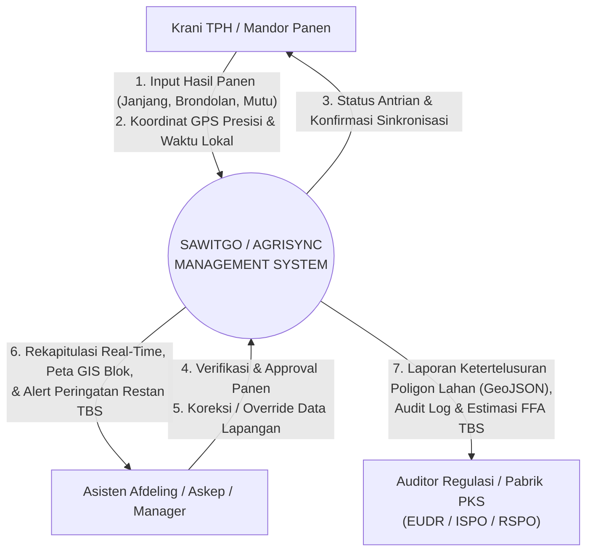
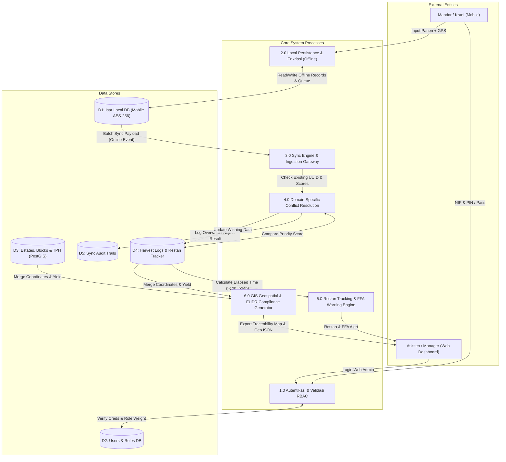
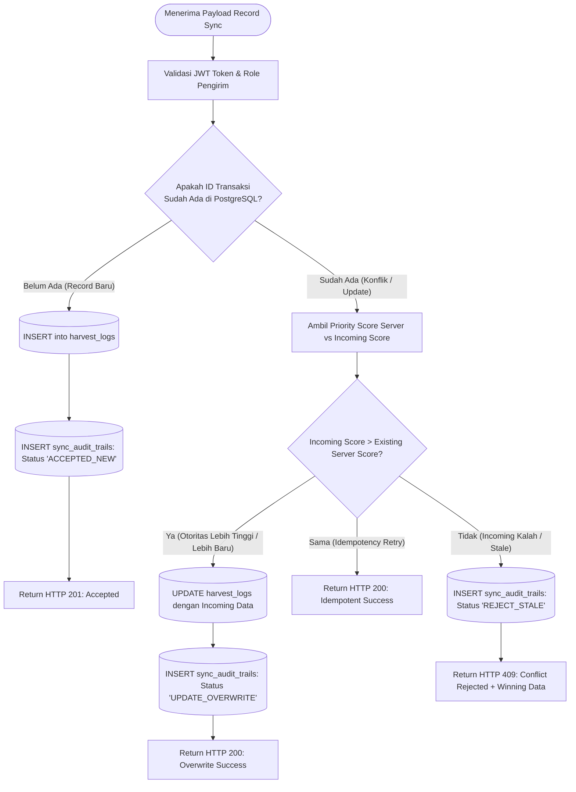
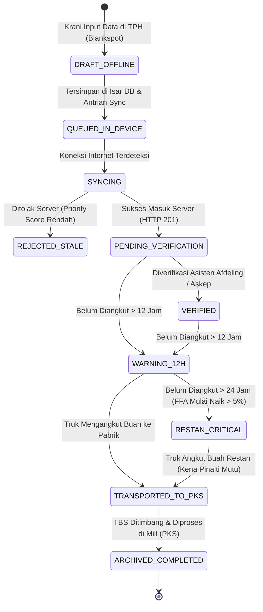

# DIAGRAM ALIR LENGKAP SAWITGO (AGRISYNC)
## DFD Level 0, DFD Level 1, Flowchart Sync & Conflict Resolution, State Chart
**Versi:** 1.0.0  
**Status:** Single Source of Truth (SSOT) - Fase 0  
**Tanggal:** 17 Agustus 2026

---

## 1. Data Flow Diagram (DFD) Level 0 / Context Diagram



---

## 2. Data Flow Diagram (DFD) Level 1



---

## 3. Flowchart: End-to-End Local Sync & Store-and-Forward Engine (Flutter)

```mermaid
flowchart TD
    START([Mulai Input Data Panen]) --> INPUT[User Input: TPH, Blok, Janjang, Brondolan, Mutu]
    INPUT --> GPS[Ambil Titik GPS Hardware]
    GPS --> CHECK_ACC{Akurasi GPS < 5 meter?}
    
    CHECK_ACC -- Tidak --> WARN_GPS[Tampilkan Warning Akurasi Rendah / Kalibrasi Ulang] --> GPS
    CHECK_ACC -- Ya --> COMPUTE[Hitung Priority Score Lokal:<br/>Score = RoleWeight * 1.000.000 + TimestampMs]
    
    COMPUTE --> SAVE_LOCAL[(Simpan Record ke Isar DB Terenkripsi AES-256)]
    SAVE_LOCAL --> ENQUEUE[(Masukkan ke Koleksi PendingSyncQueue)]
    ENQUEUE --> UI_READY[Update UI: Badge 'Tersimpan Offline - Menunggu Sinyal']
    
    UI_READY --> TIMER[Background Connectivity Observer Loop (Tiap 30 Detik)]
    TIMER --> CHECK_NET{Internet Terkoneksi?}
    
    CHECK_NET -- Tidak (Blankspot) --> IDLE[Tetap di Antrian Lokal / Standby] --> TIMER
    CHECK_NET -- Ya (Online) --> BATCH[Ambil 50 Record dari PendingSyncQueue]
    
    BATCH --> SEND_API[Kirim POST /api/v1/sync/batch via Dio Client]
    SEND_API --> HTTP_RES{HTTP Response Code?}
    
    HTTP_RES -- 200 / 201 Success --> DEQUEUE[Hapus dari PendingSyncQueue]
    DEQUEUE --> MARK_SYNCED[Set is_synced = true di Isar DB]
    MARK_SYNCED --> NOTIF_OK[Tampilkan Notifikasi 'Sinkronisasi Berhasil']
    
    HTTP_RES -- 409 Conflict (Stale Data) --> AUDIT_LOCAL[Tandai Status Lokal: 'DITOLAK - DATA SERVER LEBIH TINGGI']
    AUDIT_LOCAL --> DEQUEUE
    
    HTTP_RES -- 500 / Network Error --> RETRY[Tambah Retry Count, Exponential Backoff]
    RETRY --> TIMER
```

---

## 4. Flowchart: Server-Side Domain-Specific Conflict Resolution Engine (NestJS)



---

## 5. State Machine Diagram: Lifecycle Transaksi Panen & Restan TBS


