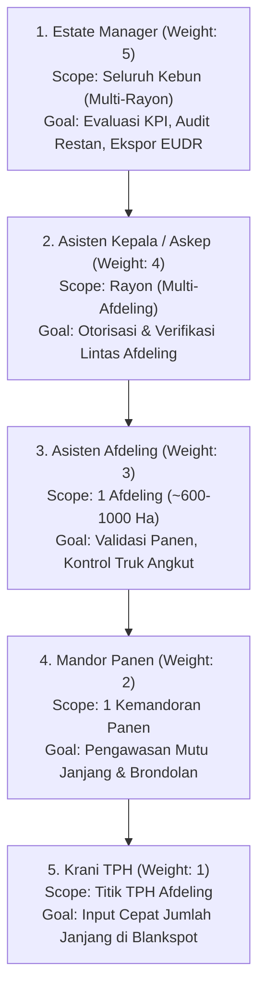
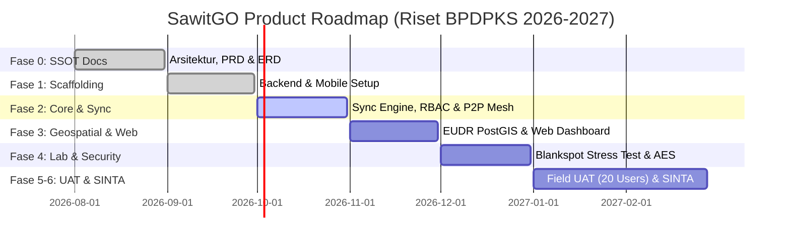

# PRODUCT REQUIREMENTS DOCUMENT (PRD)
## Proyek: SawitGO (AgriSync) — Offline-First Palm Plantation Management & Traceability System
**Versi:** 1.0.0  
**Status:** Approved SSOT (Single Source of Truth) - Fase 0  
**Target Riset:** Lomba Riset Mahasiswa BPDPKS 2026–2027  
**Institusi:** Program Studi D4 Teknologi Rekayasa Perangkat Lunak, Politeknik Citra Widya Edukasi (Bekasi)  
**Tanggal:** 17 Agustus 2026  
**Penulis Utama:** Felich Pehagasa Ginting (Technical Lead & System Architect)

---

## 1. Executive Summary & Problem Statement

### 1.1 Latar Belakang & Masalah
Industri perkebunan kelapa sawit menyumbang devisa krusial bagi Indonesia. Namun, efisiensi rantai pasok dari kebun ke pabrik pengolahan (PKS) masih terhambat oleh proses manual dan geografis ekstrem:
1. **Risiko Restan TBS Tinggi (15%–20%)**: Keterlambatan informasi panen harian memicu penumpukan buah di Tempat Pengumpulan Hasil (TPH) melampaui 24 jam. Hal ini memicu lonjakan Asam Lemak Bebas (*Free Fatty Acid* / FFA) $> 5\%$, yang mengakibatkan pinalti pemotongan harga Crude Palm Oil (CPO) sebesar 10%–12% per ton.
2. **Keterbatasan Konektivitas *Blankspot***: Sebagian besar area afdeling perkebunan tidak memiliki sinyal seluler. Aplikasi *cloud-centric* konvensional gagal beroperasi dan mengakibatkan *data loss*.
3. **Kepatuhan Regulasi Ketertelusuran Global (EUDR, ISPO, RSPO)**: Standar pasar ekspor mewajibkan setiap kilogram buah sawit dapat ditelusuri (*traceable*) ke titik koordinat TPH dan poligon persil blok lahan asal.

### 1.2 Solusi Produk: SawitGO (AgriSync)
SawitGO adalah ekosistem digital terintegrasi yang terdiri dari:
- **Mobile Android App (Offline-First)**: Dibangun dengan Flutter + Isar DB terenkripsi *AES-256*, memungkinkan pencatatan panen 100% tanpa sinyal dan pengiriman otomatis (*Store-and-Forward*) saat sinyal terdeteksi.
- **Weighted CRDT Conflict Resolution Engine**: Algoritma resolusi benturan data berbasis hirarki peran perkebunan 5 Jenjang (Manager $\rightarrow$ Askep $\rightarrow$ Asisten $\rightarrow$ Mandor $\rightarrow$ Krani) dan *BigInt Timestamp* milidetik.
- **Executive Web Dashboard & PostGIS GIS Engine**: Pemantauan hasil panen real-time, *heatmap* risiko restan, dan generator sertifikasi kepatuhan EUDR GeoJSON.

---

## 2. Product Objectives & Target Metrics (KPIs)

| Kategori Metrik | Baseline (Kondisi Eksisting) | Target SawitGO (TKT 5) |
|---|:---:|:---:|
| **Waktu Rekonsiliasi Data Panen** | 180 menit / hari / afdeling | **$< 30$ menit / hari / afdeling** |
| **Penurunan Risiko Buah Restan (>24h)** | 15% – 20% dari total panen | **Menurun $\ge 40\%$** |
| **Sync Success Rate (Area Blankspot)** | N/A (Manual Kertas) | **$\ge 98\%$** |
| **Latensi Sinkronisasi saat Online** | N/A | **$< 5$ detik / batch 50 record** |
| **Akurasi Pemetaan Spasial (EUDR)** | Estimasi manual | **100% Presisi (GPS $< 5$ meter)** |
| **System Usability Scale (SUS)** | N/A | **$\ge 70$ (Good / Acceptable)** |

---

## 3. User Personas & RBAC 5-Tier Hierarchy

---

## 4. Detailed Feature Requirements (Epics & User Stories)

### EPIC 1: Offline-First Ingestion & Mobile Core (Flutter)
- **REQ-MOB-01 (Offline Data Entry)**: Krani/Mandor dapat menginput data panen (TPH, Blok, Janjang, Brondolan, Mutu: Mentah/Masak/Lewat Masak/Tangkai Panjang) tanpa koneksi internet.
- **REQ-MOB-02 (High-Precision GPS Lock)**: Aplikasi mengunci koordinat GPS perangkat. Jika akurasi $> 5.0$ meter, sistem memberikan peringatan untuk mengkalibrasi ulang.
- **REQ-MOB-03 (At-Rest Encryption)**: Seluruh data lokal di Isar DB wajib terenkripsi menggunakan *AES-256-CBC* dengan kunci yang disimpan di *Hardware Android Keystore*.
- **REQ-MOB-04 (Store-and-Forward Background Sync)**: Worker background otomatis memantau konektivitas setiap 30 detik. Saat online, data dikirim secara batch (maks 50 record/payload).
- **REQ-MOB-05 (Field Ergonomics)**: Antarmuka menggunakan palet kontras tinggi, font angka 32sp, dan tombol aksi minimal 56dp (ramah sarung tangan & terik matahari).

### EPIC 2: Weighted RBAC Conflict Resolution Engine (NestJS)
- **REQ-ENG-01 (Priority Score Calculation)**: Sistem mengevaluasi formula:
  $$\text{Priority Score} = (\text{Role Weight} \times 1.000.000) + \text{Client Timestamp (ms)}$$
- **REQ-ENG-02 (Deterministic Conflict Resolution)**: Jika terjadi benturan data di server:
  - Skor kiriman $>$ skor tersimpan: Data server di-overwrite (HTTP 200).
  - Skor kiriman $\le$ skor tersimpan: Data ditolak sebagai *stale* (HTTP 409) dan dicatat di *Audit Trail*.
- **REQ-ENG-03 (Idempotency Guard)**: Mencegah duplikasi data akibat koneksi putus-nyambung menggunakan hash SHA-256 unik per transaksi.

### EPIC 3: Geospatial & EUDR Compliance (PostGIS)
- **REQ-GEO-01 (Polygon Boundary Verification)**: Server memvalidasi apakah koordinat TPH dan pencatatan berada di dalam poligon blok (`ST_Contains`).
- **REQ-GEO-02 (EUDR GeoJSON Exporter)**: Manager/Askep dapat mengekspor data ketertelusuran ke format standar GeoJSON WGS84 (SRID 4326) untuk kebutuhan audit ekspor.

### EPIC 4: Restan Monitoring & FFA Degradation Tracker
- **REQ-RES-01 (Restan Alert Engine)**: Sistem mendeteksi durasi penumpukan buah di TPH sejak waktu panen:
  - $\ge 12$ Jam: *Stage 1 Warning* (Kuning).
  - $\ge 20$ Jam: *Stage 2 Critical Alert* (Oranye).
  - $> 24$ Jam: *Restan Overdue* (Merah - Estimasi FFA $> 5\%$).
- **REQ-RES-02 (Pickup Confirmation)**: Mandor/Supir Truk dapat mencatat waktu angkut (*pickup timestamp*) untuk menyelesaikan siklus hidup restan.

### EPIC 5: Executive Web Dashboard
- **REQ-WEB-01 (GIS Map View)**: Tampilan peta interaktif poligon blok dan status titik TPH (Hijau: Normal, Kuning: 12h, Merah: Restan).
- **REQ-WEB-02 (Executive KPI Cards)**: Menampilkan total tonase harian (Kg), estimasi rendemen CPO, rata-rata FFA kebun, dan persentase buah restan.

---

## 5. Non-Functional Requirements (NFRs)

1. **Keandalan (*Reliability*)**: *Zero Data Loss* pada aplikasi mobile saat perangkat mati mendadak atau kehabisan baterai di kebun.
2. **Kinerja (*Performance*)**: Waktu respon API ingestion $< 500$ ms per batch. Konsumsi RAM mobile app $< 150$ MB pada perangkat *Android Low-Spec*.
3. **Keamanan (*Security*)**: Enkripsi *AES-256-CBC* (lokal) + *TLS 1.3 Pinning* (in-transit) + *RS256 JWT Authentication*.
4. **Kompatibilitas (*Compatibility*)**: Berjalan lancar pada sistem operasi Android 8.0 (Oreo) hingga Android 14+.

---

## 6. Project Scope & Out of Scope (Batasan Riset BPDPKS)

### In-Scope (TKT 5 - 6 Bulan Riset):
- Modul Inti: Agronomi / Panen & Ketertelusuran (*Traceability*).
- Modul Restan & Estimasi FFA.
- Sinkronisasi Offline-First (Store-and-Forward) & Resolusi Konflik RBAC 5 Jenjang.
- Modul Realtime Offline P2P Mesh (Wi-Fi Direct / BLE Local Sync & Data Mule Delivery).
- Uji coba lapangan terbatas di kebun percontohan Politeknik CWE dengan 20 responden riil.

### Out of Scope (Pengembangan Pasca-Riset / Fase Lanjutan):
- Integrasi modul keuangan (*Payroll* gaji pemanen & akuntansi ERP SAP/Oracle).
- Modul pemeliharaan tanaman (pemupukan, *weed control*) dan pabrik pengolahan kelapa sawit (PKS) terperinci.
- IoT Sensor timbangan otomatis di truk jangkang.

---

## 7. Product Roadmap (6-Bulan Timeline)

