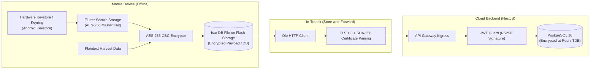

# DOKUMEN PROTOKOL ENKRIPSI & KEAMANAN OFFLINE-FIRST
## Proyek: SawitGO (AgriSync) - AES-256-CBC, Secure Keystore, & TLS 1.3
**Versi:** 1.0.0  
**Status:** Single Source of Truth (SSOT) - Fase 0  
**Tanggal:** 17 Agustus 2026

---

## 1. Arsitektur Keamanan Data End-to-End



---

## 2. Spesifikasi Enkripsi Data Lokal (At-Rest)

1. **Algoritma**: `AES-256` dalam mode `CBC` (*Cipher Block Chaining*) dengan padding `PKCS7`.
2. **Kunci Enkripsi (Key Generation)**:
   - Dihasilkan secara acak secara kriptografis menggunakan `Random.secure()` sebesar 256-bit (32 bytes).
   - Kunci tidak pernah disimpan di teks biasa (*plaintext*) atau hardcoded di source code.
   - Kunci disimpan langsung di sistem keamanan perangkat keras (*Hardware-backed Android Keystore* via `flutter_secure_storage`).
3. **Inisialisasi Vector (IV)**:
   - IV acak 128-bit (16 bytes) dibuat unik untuk setiap payload enkripsi.
   - IV digabungkan di depan teks sandi (*ciphertext*) sebagai prefix `[IV_16_BYTES + CIPHERTEXT]`.

### Implementasi Dart Helper:
```dart
import 'dart:convert';
import 'dart:typed_data';
import 'package:encrypt/encrypt.dart' as enc;
import 'package:flutter_secure_storage/flutter_secure_storage.dart';

class LocalCryptoService {
  static const _storage = FlutterSecureStorage();
  static const _keyAlias = 'SAWITGO_LOCAL_MASTER_KEY_V1';

  static Future<enc.Key> getOrCreateMasterKey() async {
    String? base64Key = await _storage.read(key: _keyAlias);
    if (base64Key == null) {
      final key = enc.Key.fromSecureRandom(32);
      await _storage.write(key: _keyAlias, value: base64Key = key.base64);
      return key;
    }
    return enc.Key.fromBase64(base64Key);
  }

  static Future<String> encryptPayload(String plainText) async {
    final key = await getOrCreateMasterKey();
    final iv = enc.IV.fromSecureRandom(16);
    final encrypter = enc.Encrypter(enc.AES(key, mode: enc.AESMode.cbc));
    
    final encrypted = encrypter.encrypt(plainText, iv: iv);
    // Combine IV and Ciphertext as Base64
    final combined = iv.bytes + encrypted.bytes;
    return base64Encode(combined);
  }

  static Future<String> decryptPayload(String base64Combined) async {
    final key = await getOrCreateMasterKey();
    final allBytes = base64Decode(base64Combined);
    final ivBytes = allBytes.sublist(0, 16);
    final cipherBytes = allBytes.sublist(16);

    final iv = enc.IV(Uint8List.fromList(ivBytes));
    final encrypter = enc.Encrypter(enc.AES(key, mode: enc.AESMode.cbc));
    
    return encrypter.decrypt(enc.Encrypted(Uint8List.fromList(cipherBytes)), iv: iv);
  }
}
```

---

## 3. Protokol Anti-Replay & Idempotensi
- Setiap batch sync yang dikirimkan oleh mobile device menyertakan `idempotencyKey` yang dibentuk dari:
  $$\text{idempotencyKey} = \text{SHA256}(\text{DeviceID} + \text{TransactionUUID} + \text{ClientTimestampMs})$$
- Backend memanfaatkan tabel `sync_audit_trails` & Redis cache (TTL 24 jam) untuk mendeteksi request duplikat jika terjadi pengiriman ulang akibat koneksi sinyal terputus di tengah jalan.
