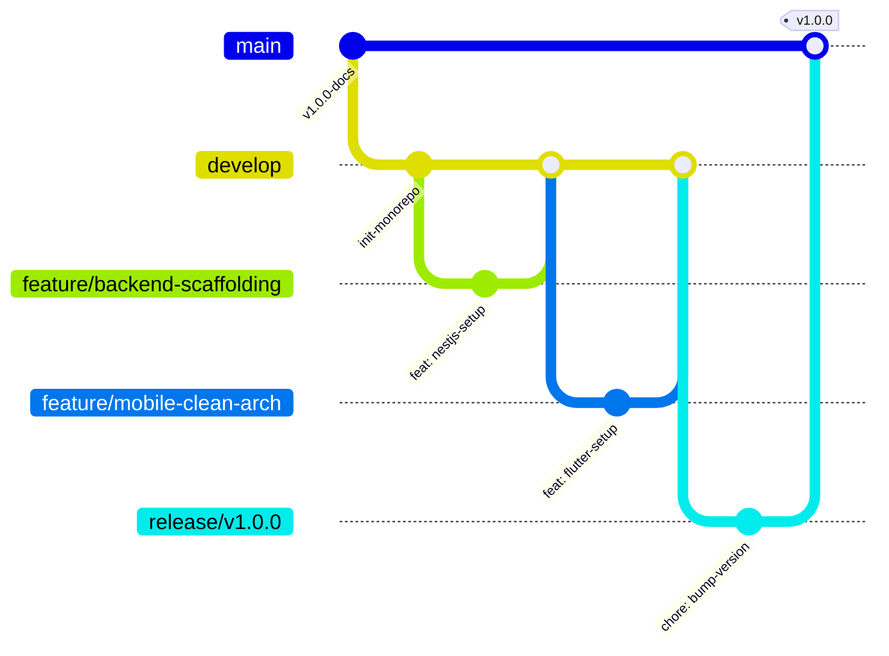

# STANDAR KONVENSI MONOREPO, GIT FLOW & BRANCHING STRATEGY
## Proyek: SawitGO (AgriSync) - Multi-Tier Monorepo
**Versi:** 1.0.0  
**Tanggal:** 17 Agustus 2026

---

## 1. Struktur Folder Monorepo

```
SawitGO/
├── apps/
│   ├── mobile/              # Aplikasi Flutter Android (Offline-First, Isar DB, BLoC)
│   ├── backend/             # NestJS API Gateway, PostGIS Ingestion, Conflict Engine
│   └── web/                 # Web Executive Dashboard (React / Next.js GIS Viewer)
├── packages/
│   └── shared-types/        # DTO, TypeScript Interfaces, & Shared Constants
├── docs/                    # Single Source of Truth (SSOT) Architecture Docs
├── diagrams/                # Arsitektur DFD, Sequence & State Machine Diagrams
├── mock_data/               # Sample data, geospasial polygons, dan test seed
└── .github/
    └── workflows/           # CI/CD Quality Gates & Lint Checkers
```

---

## 2. Strategi Branching & Git Flow



### Aturan Branch:
1. `main` (Production): Kode stabil yang telah lolos pengujian laboratorium / TKT 5.
2. `develop` (Integration): Branch integrasi harian 5 mahasiswa pengembang.
3. `feature/<nama-fitur>`: Branch kerja individual (contoh: `feature/sync-engine`, `feature/tph-picker-ui`).
4. `fix/<nama-bug>`: Perbaikan bug khusus (contoh: `fix/gps-accuracy-filter`).

---

## 3. Format Pesan Commit (Conventional Commits)

Format: `<type>(<scope>): <subject>`

Contoh:
- `feat(mobile): add isar db local encryption helper`
- `feat(backend): implement priority score conflict resolution in sync module`
- `fix(geospatial): fix polygon boundary point-in-polygon validation`
- `docs(api): update swagger contract for /api/v1/sync/batch`
- `test(sync): add stress testing scenario with locust`
