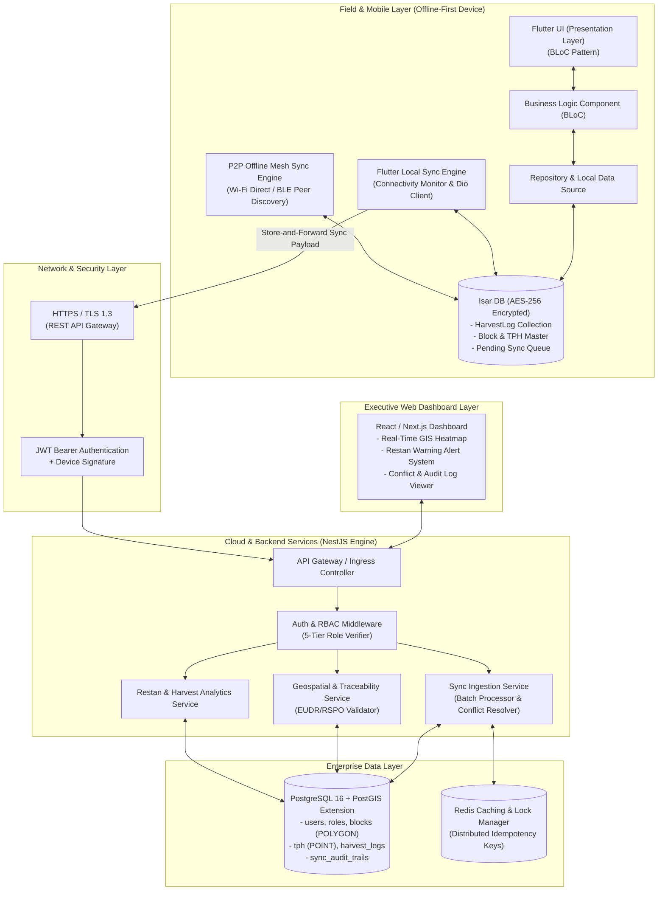
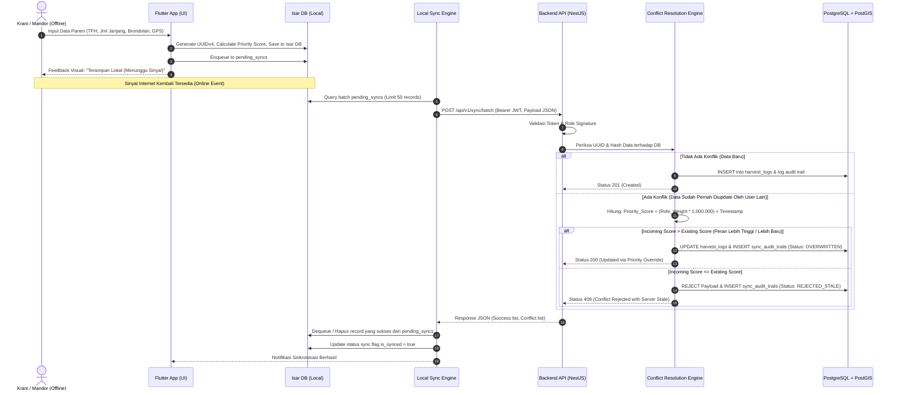
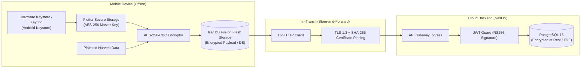

# SYSTEM ARCHITECTURE DOCUMENT (SAD)
## Proyek: SawitGO (AgriSync) - Offline-First Palm Plantation Management & Traceability System
**Versi:** 1.0.0  
**Status:** Single Source of Truth (SSOT) - Fase 0  
**Tanggal:** 17 Agustus 2026  
**Penulis/Arsitek:** Felich Pehagasa Ginting (Technical Lead & System Architect)

---

## 1. Ringkasan Eksekutif & Prinsip Desain
SawitGO (AgriSync) dirancang khusus untuk memecahkan problem operasional kebun kelapa sawit di area *blankspot* ekstrem, keterlambatan pelaporan panen yang memicu restan TBS (Tandan Buah Segar), degradasi FFA (*Free Fatty Acid*), dan audit ketertelusuran standar global (**EUDR, ISPO, RSPO**).

### Prinsip Utama Arsitektur:
1. **Offline-First & Local Persistence**: Aplikasi mobile berjalan 100% tanpa internet menggunakan local database (*Isar DB*) dengan enkripsi *AES-256*.
2. **Store-and-Forward Sync Engine**: Setiap transaksi lokal diantrekan secara terstruktur (*pending sync queue*) dan dikirim otomatis ketika sinyal terdeteksi.
3. **P2P Realtime Offline Mesh (Ad-Hoc Sync)**: Mendukung sinkronisasi peer-to-peer antar-perangkat di lapangan via Wi-Fi Direct / BLE dan kurir data bergerak (*Data Mule* truk panen).
4. **Domain-Specific Conflict Resolution**: Menyelesaikan benturan data (*data conflict*) dengan memprioritaskan hirarki manajerial perkebunan (*Weighted RBAC*) dan presisi stempel waktu milidetik (*BigInt Timestamp*).
5. **Native Geospatial Traceability**: Pencatatan koordinat GPS batas poligon blok dan titik TPH (*Tempat Pengumpulan Hasil*) berakurasi tinggi (< 5 meter) berbasis standar PostGIS & GeoJSON.

---

## 2. Diagram Arsitektur Tingkat Tinggi (High-Level Architecture)



---

## 3. Topologi Aliran Data (Data Flow Pipeline)

Aliran data dari saat mandor/krani menginput data panen di kebun sawit hingga tersimpan di PostgreSQL server pusat:



---

## 4. Pola Arsitektur Mobile (Clean Architecture Flutter)

Aplikasi mobile SawitGO mengimplementasikan Clean Architecture 3-Layer untuk memisahkan UI, logika bisnis, dan mekanisme database lokal:

```
apps/mobile/
├── lib/
│   ├── core/
│   │   ├── constants/         # Role weights, API endpoints, error strings
│   │   ├── crypto/            # AES-256 encryption helper for Isar & secure storage
│   │   ├── network/           # Dio client, Interceptors, Network Connectivity Observer
│   │   └── utils/             # Geolocation parser (GeoJSON), Date/Timestamp parser
│   ├── features/
│   │   ├── auth/              # Login, PIN Authentication, Secure Token Storage
│   │   ├── harvest/           # Input Panen, TPH Selector, Brondolan Tracker
│   │   │   ├── data/          # Isar Harvest Collection, Remote DataSource, Repositories
│   │   │   ├── domain/        # HarvestLog Entity, UseCases (SaveHarvest, GetLocalSummary)
│   │   │   └── presentation/  # BLoC, Pages, Widgets (TPH Dropdown, GPS Lock Button)
│   │   ├── sync/              # Background Sync Worker, Queue Handler, Retry Policy
│   │   │   ├── data/          # SyncQueue Collection, Sync Remote API
│   │   │   ├── domain/        # SyncEngine UseCase, Conflict Resolution Callback
│   │   │   └── presentation/  # Sync Status Banner, Manual Sync Trigger Widget
│   │   └── geospatial/        # Offline Map Tile Cache, Boundary Verification Widget
│   └── main.dart
```

---

## 5. Pola Arsitektur Backend (Modular NestJS & PostGIS)

Backend dirancang berbasis arsitektur modular (*micro-modular monolith*):

```
apps/backend/
├── src/
│   ├── common/
│   │   ├── decorators/        # @Roles(), @CurrentUser()
│   │   ├── guards/            # JwtAuthGuard, RolesGuard (5-Tier RBAC)
│   │   ├── interceptors/      # ResponseTransformInterceptor, LoggingInterceptor
│   │   └── filters/           # GlobalHttpExceptionFilter
│   ├── config/                # Database (PostGIS), Redis, JWT configuration
│   ├── database/
│   │   ├── migrations/        # TypeORM spatial migrations
│   │   └── seeds/             # Master Afdeling, Blok, TPH, & Role seeders
│   └── modules/
│       ├── auth/              # JWT issuance, refresh tokens, role resolution
│       ├── users/             # User entity, credential management
│       ├── blocks/            # Estate, Afdeling, & Block Polygons (PostGIS geometry)
│       ├── tph/               # Tempat Pengumpulan Hasil coordinates (PostGIS Point)
│       ├── sync/              # POST /api/v1/sync, Priority Score Engine, Idempotency Guard
│       ├── harvest/           # Harvest CRUD, Daily TPH Aggregator
│       ├── restan/            # Restan detection algorithm (>24h delay triggers)
│       └── analytics/         # Executive KPIs, EUDR compliance export (GeoJSON/Shapefile)
```

---

## 6. Protokol Keamanan & Proteksi Data (Security & Cryptography)



### A. At-Rest Encryption (Mobile AES-256-CBC)
- **Algoritma**: `AES-256` dalam mode `CBC` dengan padding `PKCS7`.
- **Master Key Security**: Kunci acak 256-bit dihasilkan via `Random.secure()` dan disimpan di *Hardware-backed Android Keystore* via `flutter_secure_storage` (tidak di-hardcode).
- **Dynamic IV**: Prefix 16-byte acak disisipkan di depan ciphertext `[IV_16_BYTES + CIPHERTEXT]`.

### B. In-Transit Security & TLS Pinning
- Komunikasi API mewajibkan protokol TLS 1.3 dengan *SHA-256 Certificate Pinning* di mobile client.

### C. Idempotency Key & Anti-Replay Guard
- Setiap transaksi pengiriman batch memiliki token unik:
  $$\text{idempotencyKey} = \text{SHA256}(\text{DeviceID} + \text{TransactionUUID} + \text{ClientTimestampMs})$$
- Backend memanfaatkan Redis & `sync_audit_trails` untuk mencegah duplikasi data jika koneksi putus di tengah jalan.
