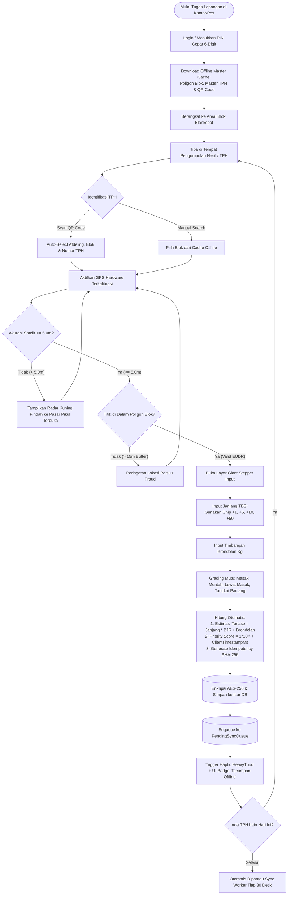
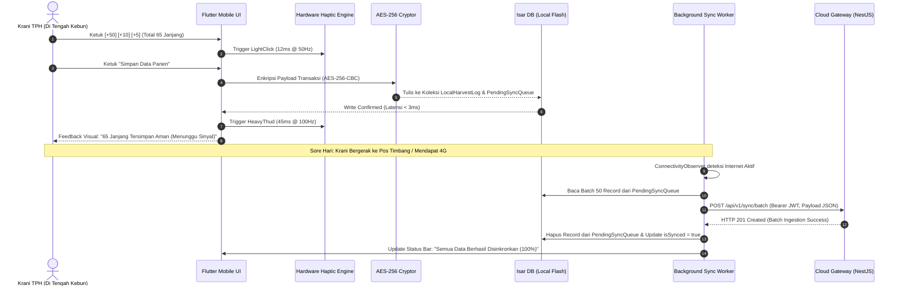
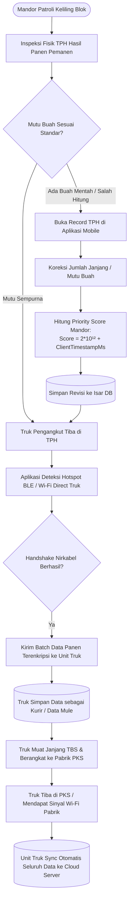
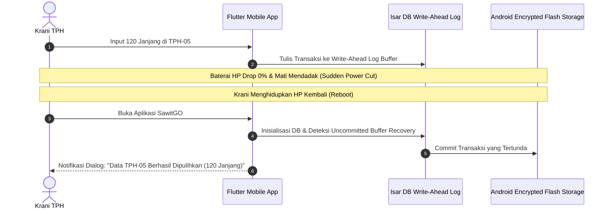
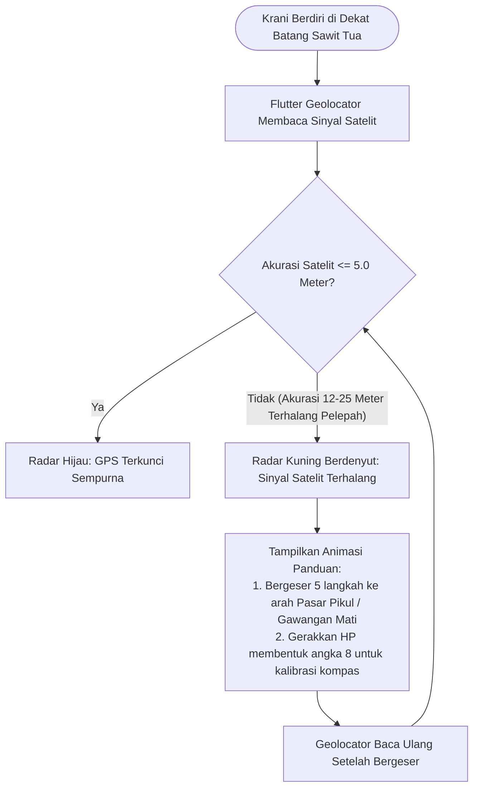
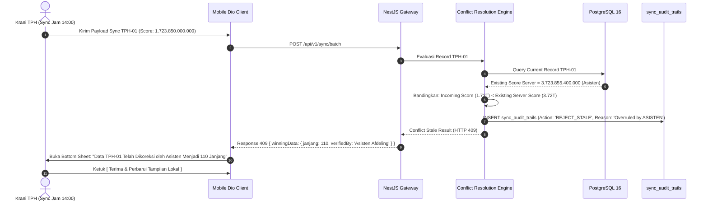

# SPESIFIKASI ALUR PENGGUNA & OPERASIONAL KEBUN (USER FLOW SSOT)

## Proyek: SawitGO (AgriSync) — Offline-First Multi-Role Plantation Ecosystem

**Dokumen:** Master User Journeys, Sequence Diagrams, State Machines & Fail-Safe Workflows  
**Versi:** 2.0.0 (Enterprise / FAANG-Grade)  
**Status:** Approved SSOT (Single Source of Truth)  
**Tanggal:** 17 Agustus 2026  
**Penulis:** Felich Pehagasa Ginting (Technical Lead & System Architect)

---

## 1. Ekosistem Pengguna & Matriks Peran 5 Jenjang

SawitGO dirancang untuk mencakup seluruh rantai komando operasional perkebunan kelapa sawit dari titik fisik penumpukan buah di tengah hutan (*TPH*) hingga evaluasi eksekutif di kantor direksi dan gerbang timbang Pabrik Kelapa Sawit (PKS).

```text
   ┌────────────────────────────────────────────────────────────────────────┐
   │                  STRUKTUR HIRARKI RBAC 5 JENJANG SAWITGO               │
   ├───────┬───────────────────┬──────────────┬─────────────────────────────┤
   │ Level │ Role / Jabatan    │ Bobot ($W_r$)│ Lingkup Tanggung Jawab      │
   ├───────┼───────────────────┼──────────────┼─────────────────────────────┤
   │ 1     │ Estate Manager    │ 5 (Tertinggi)│ Seluruh Kebun & Ekspor EUDR │
   │ 2     │ Asisten Kepala    │ 4            │ Rayon (Multi-Afdeling)      │
   │ 3     │ Asisten Afdeling  │ 3            │ 1 Afdeling (~600–1000 Ha)   │
   │ 4     │ Mandor Panen      │ 2            │ 1 Kemandoran (15–25 Pemanen)│
   │ 5     │ Krani TPH         │ 1            │ Titik TPH (Input Lapangan)  │
   └───────┴───────────────────┴──────────────┴─────────────────────────────┘
```

---

## 2. Peta Alur Peran 1: Krani TPH (Weight 1) — Field Ingestion di Area Blankspot

Krani bertugas mencatat hasil panen fisik secara cepat dan akurat di area kebun yang tidak memiliki sinyal seluler (*100% blankspot*).

### A. Diagram Alir Krani TPH (Mermaid Flowchart)



### B. Diagram Sekuensial: Krani Menyimpan Data Offline & Auto-Sync saat Online



---

## 3. Peta Alur Peran 2: Mandor Panen (Weight 2) — Supervisi & P2P Data Mule Sync

Mandor bertanggung jawab atas mutu panen 1 kemandoran (15–25 pemanen) dan memfasilitasi pertukaran data secara offline menggunakan armada truk angkut (*Data Mule*).

### A. Diagram Alir Mandor & P2P Data Mule (Mermaid Flowchart)



---

## 4. Peta Alur Peran 3: Asisten Afdeling (Weight 3) — Inspeksi, Resolusi Konflik & Restan Alert

Asisten Afdeling mengawasi 1 afdeling (~600–1000 Ha), memiliki wewenang mengoreksi data mandor/krani (*Priority Override*), serta mencegah penumpukan buah restan.

### A. Diagram Alir Asisten Afdeling & Resolusi Restan

```mermaid
flowchart TD
    START([Asisten Login di Mobile / Tablet]) --> DASH_AFD[Dashboard Afdeling: Monitor Progres Panen & Restan]
    DASH_AFD --> RESTAN_CHECK{Ada TPH Restan >= 12 Jam?}
    
    RESTAN_CHECK -- Ya (Kuning / Oranye) --> DISPATCH_TRUCK[Kirim Instruksi Dispatch Truk Terdekat ke TPH Tersebut]
    DISPATCH_TRUCK --> TRACK_PICKUP[Pantau Waktu Muat Truk]
    
    RESTAN_CHECK -- Tidak --> FIELD_INSPECT[Inspeksi Lapangan ke Blok Tertentu]
    FIELD_INSPECT --> FOUND_ERROR{Ditemukan Koreksi Data Panen?}
    
    FOUND_ERROR -- Ya --> INPUT_OVERRIDE[Asisten Input Koreksi Data di TPH]
    INPUT_OVERRIDE --> CALC_ASISTEN[Hitung Score Asisten: 3*10¹² + Timestamp]
    CALC_ASISTEN --> SYNC_SERVER[(Kirim ke Server)]
    
    SYNC_SERVER --> SERVER_CONFLICT{Server Bandingkan Score Asisten vs Krani/Mandor}
    SERVER_CONFLICT --> WIN_ASISTEN[Data Asisten Menang Mutlak (3.72T > 1.72T)]
    WIN_ASISTEN --> DB_UPDATE[(Database Server Di-Overwrite)]
    DB_UPDATE --> AUDIT_LOG[(Tercatat di sync_audit_trails: 'UPDATE_OVERWRITE')]
    
    FOUND_ERROR -- Tidak --> APPROVE_PANEN[Asisten Verifikasi Data Harian Afdeling]
    APPROVE_PANEN --> END([Selesai])
```

---

## 5. Peta Alur Peran 4 & 5: Askep & Estate Manager (Executive Command Center)

Estate Manager dan Askep memantau operasional seluruh kebun melalui Web Command Center Next.js, mengontrol risiko degradasi FFA, dan mengekspor dokumen audit kepatuhan EUDR.

### A. Diagram Alir Executive Command Center & Ekspor EUDR

```mermaid
flowchart TD
    START([Manager Buka Web Command Center]) --> AUTH_WEB[Autentikasi JWT & Role Check: MANAGER (Weight 5)]
    AUTH_WEB --> LOAD_BENTO[Render Bento Grid KPI:<br/>Total Tonase, BJR Rata², Restan %, Estimasi FFA %]
    
    LOAD_BENTO --> RENDER_MAP[Render PostGIS WebGL GIS Map Engine]
    RENDER_MAP --> LAYER_CONTROL{Pilih Layer Tampilan}
    
    LAYER_CONTROL -- Poligon Blok & Sertifikasi --> SHOW_POLY[Tampilkan Batas Blok Hijau RSPO/ISPO/EUDR]
    LAYER_CONTROL -- Heatmap Restan TBS --> SHOW_HEATMAP[Tampilkan Titik TPH: Hijau Normal, Kuning 12h, Merah >24h]
    LAYER_CONTROL -- Posisi Truk Angkut --> SHOW_TRUCKS[Tampilkan Vektor Lokasi Truk & Muatan Tonase]
    
    SHOW_HEATMAP --> DETECT_RESTAN{Ada TPH Restan > 24 Jam?}
    DETECT_RESTAN -- Ya (FFA > 5%) --> CRITICAL_MODAL[Tampilkan Peringatan Kritis Pinalti Rendemen CPO]
    CRITICAL_MODAL --> ESCALATE_ACTION[Hubungi Asisten Afdeling & Koordinator Transport]
    
    SHOW_POLY --> EXPORT_EUDR[Klik Tombol 'Ekspor Sertifikat Kepatuhan EUDR']
    EXPORT_EUDR --> GEN_GEOJSON[Backend Generate GeoJSON FeatureCollection WGS84 WGS:4326]
    GEN_GEOJSON --> DOWNLOAD_FILE[Unduh Dokumen Audit Resmi untuk Buyer Eropa / RSPO]
```

---

## 6. Skenario Khusus & Penanganan Kasus Ekstrem (Fail-Safe Workflows)

### Skenario A: Perangkat Mati Mendadak / Habis Baterai Saat Input di Tengah Hutan



### Skenario B: Kalibrasi GPS di Bawah Kanopi Sawit Rapat (Forest Canopy Multipath)



### Skenario C: Konflik Data Sinkronisasi Krani vs Asisten (Simultaneous Offline Edit)

```text
Kronologi Kejadian di Lapangan:
08:00 WIB (Offline) : Krani mencatat 120 Janjang di TPH-01 (Score: 1.723.850.000.000)
09:30 WIB (Offline) : Asisten inspeksi & koreksi menjadi 110 Janjang (Score: 3.723.855.400.000)
12:00 WIB (Online)  : Asisten tiba di kantor afdeling & sync duluan -> Server Simpan 110 Janjang (Score 3.72T)
14:00 WIB (Online)  : Krani baru dapat sinyal 4G di pos timbang & sync payload 120 Janjang (Score 1.72T)
```



---

## 7. Matriks State Transisi Layar & Indikator Visual

| Kondisi Sistem | Indikator Status Bar | Aksi Tombol Simpan | Respon Getar Hardware | Keterangan untuk Pengguna |
| :--- | :--- | :--- | :--- | :--- |
| **Online Sempurna** | 🟢 `ONLINE (4G/Wi-Fi)` | Aktif (Hijau Solid) | `HeavyThud` | Data langsung dikirim ke server dalam 500ms |
| **Blankspot Offline** | 🔴 `OFFLINE (Isar DB)` | Aktif (Hijau Disket) | `HeavyThud` | Data disimpan terenkripsi di memori ponsel |
| **Mule Terdeteksi** | 🔵 `P2P TRUK AKTIF` | Aktif (Biru Mesh) | `SuccessPulse` | Siap kirim data nirkabel ke truk pengangkut |
| **GPS Lemah (>5m)** | 🟡 `GPS KALIBRASI (8m)` | Disabled / Kuning | `WarningRumble` | Wajib bergeser ke area terbuka di pasar pikul |
| **Restan 12 Jam** | 🟡 `PERINGATAN 12 JAM` | Tampil di Dashboard | N/A | TPH masuk prioritas rute truk pengangkut |
| **Restan 24 Jam** | 🔴 `RESTAN KRITIS (FFA↑)` | Banner Merah Berkedip | `CriticalAlert` | Eskalasi darurat ke Asisten & Askep |
| **Data Di-Overwrite** | 🟠 `REVISI DITERIMA` | Sheet Konfirmasi | `DoubleBuzz` | Data lokal disesuaikan dengan hasil verifikasi |

---

## 8. Ringkasan & Standar Kualitas (Definition of Done)

- [x] **5 Peran Hirarkis Terpetakan Lengkap** (Manager, Askep, Asisten, Mandor, Krani).
- [x] **Model Store-and-Forward & P2P Data Mule** terintegrasi di setiap diagram sekuensial.
- [x] **Resolusi Konflik Matematis** konsisten dengan formula $W_r \times 10^{12} + T_{ms}$.
- [x] **Validasi Spasial EUDR & GPS Satelit $\le 5.0\text{ m}$** tertanam di langkah awal input lapangan.
- [x] **Manajemen Restan & FFA Degradasi** memiliki alur eskalasi otomatis multi-tahap.
